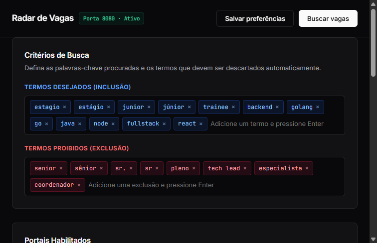

# Radar de Vagas

Sistema autônomo e inteligente para busca, filtragem e deduplicação cruzada de oportunidades de trabalho em múltiplos portais, com painel visual local e notificações estruturadas por e-mail.

`vagas` · `web-scraping` · `automacao` · `vibecoding` · `golang` · `linkedin` · `gupy`



---

## Visão Geral

O projeto foi construído para resolver o problema de fragmentação na busca por vagas de tecnologia. Muitas empresas publicam simultaneamente em plataformas diferentes como LinkedIn, Gupy e murais comunitários do GitHub.

Em vez de verificar cada portal manualmente, o sistema executa varreduras simultâneas, normaliza os dados de cargos e empresas e unifica anúncios duplicados em uma visualização única com links diretos de candidatura.

---

## Interface e Notificação

### 1. Painel de Controle Local
Interface minimalista servida localmente (`http://localhost:8080`) para calibração de termos, seleção de fontes de dados e disparo sob demanda.

* Inclusão e exclusão dinâmica de palavras-chave.
* Seleção modular entre 9 portais de vagas.
* Acionamento manual com visualização em tempo real das oportunidades.
* Configuração em um clique para o Agendador de Tarefas do Windows.

### 2. Relatório Periódico por E-mail
Notificação com design editorial limpo, entregando os cartões de vagas com identificação da empresa, modalidade de trabalho e múltiplos botões de candidatura quando a mesma vaga existe em plataformas distintas.


---

## Arquitetura do Sistema

O projeto é estruturado em dois executáveis independentes para manter a separação de responsabilidades e o consumo mínimo de recursos:

```text
vagas-scraper/
├── cmd/
│   ├── painel/                 # Ponto de entrada do painel visual (servidor local)
│   └── scraper/                # Ponto de entrada do motor autônomo (execução silenciosa)
├── internal/
│   ├── config/                 # Leitor de config.json e variáveis do .env
│   ├── dedup/                  # Motor de deduplicação cruzada e geração de chaves canônicas
│   ├── models/                 # Definições das estruturas de dados (Vaga, LinkFonte)
│   ├── notifier/               # Montagem do template editorial e envio SMTP com TLS
│   ├── scrapers/               # Módulos coletores concorrentes (LinkedIn, Gupy, GitHub, etc.)
│   ├── storage/                # Persistência de histórico para evitar reenvios
│   └── web/                    # Servidor HTTP e aplicação frontend embarcada
├── docs/
│   ├── assets/                 # Imagens e capturas de tela do sistema
│   ├── CONFIGURACAO_EMAIL.md   # Passo a passo para credenciais de envio
│   └── AGENDAMENTO_CRON.md     # Tabela de horários e fusos para automação
├── config.json                 # Definições de termos e portais ativos
├── .env.example                # Molde das variáveis de ambiente
└── vagas_vistas.json           # Registro histórico de vagas já notificadas
```

---

## Fluxo de Execução

```text
[ Agendador (Windows / Termux / GitHub Actions) ]
                      │
                      ▼
             [ Início do Motor ]
                      │
        ┌─────────────┴─────────────┐
        ▼                           ▼
[ Carrega config.json ]     [ Carrega vagas_vistas.json ]
        │                           │
        └─────────────┬─────────────┘
                      │
                      ▼
         [ Consulta Concorrente ]
   ┌──────────┬──────────┬──────────┬──────────┐
   ▼          ▼          ▼          ▼          ▼
LinkedIn     Gupy    GitHub BR   RemoteOK   Outros
   └──────────┴──────────┴──────────┴──────────┘
                      │
                      ▼
       [ Deduplicação Cruzada ]
 (Normalização de títulos e unificação de anúncios)
                      │
                      ▼
      [ Filtragem de Inclusão/Exclusão ]
(Aplica palavras desejadas e descarta termos proibidos)
                      │
                      ▼
          [ Novas Vagas Localizadas? ]
                 /          \
              Sim            Não
              /                \
             ▼                  ▼
    [ Disparo de E-mail ]   [ Encerramento Imediato ]
    [ Atualiza Histórico ]  (0% de CPU restante)
             │
             ▼
        [ Concluído ]
```

---

## Portais Suportados

1. **LinkedIn:** Consulta pública de vagas para visitantes (sem autenticação de conta).
2. **Gupy:** Extração direta de oportunidades publicadas pelas empresas parceiras.
3. **Backend-BR:** Mural comunitário brasileiro de desenvolvimento backend.
4. **Frontend-BR:** Mural comunitário focado em desenvolvimento web e mobile.
5. **React-Brasil:** Feed especializado no ecossistema React e React Native.
6. **QA-Brasil:** Oportunidades em qualidade de software, testes e automação.
7. **ProgramaThor:** Vagas em startups e empresas de tecnologia nacionais.
8. **RemoteOK:** Feed internacional de posições remotas globais.
9. **WeWorkRemotely:** Feed de oportunidades de engenharia de software distribuídas.

---

## Configuração

### 1. Variáveis de Ambiente
Copie o modelo de variáveis de ambiente:

```bash
cp .env.example .env
```

Edite o arquivo `.env` com suas informações de disparo:

```env
EMAIL_REMETENTE=seu.email@gmail.com
EMAIL_SENHA_APP=xxxx xxxx xxxx xxxx
EMAIL_DESTINATARIO=seu.email@gmail.com
SMTP_HOST=smtp.gmail.com
SMTP_PORT=587
DRY_RUN=false
```

> As credenciais permanecem salvas estritamente no arquivo local `.env`, que é ignorado pelo Git para evitar vazamentos acidentais.

### 2. Filtros de Pesquisa (`config.json`)
Os termos de interesse e exclusão são mantidos no arquivo `config.json`:

```json
{
  "filtros": {
    "termos_busca": [
      "estagio", "junior", "trainee", "backend", "fullstack"
    ],
    "termos_exclusao": [
      "senior", "pleno", "lead", "coordenador"
    ]
  },
  "fontes_habilitadas": [
    "linkedin", "gupy", "backend_br", "frontend_br", "programathor", "remoteok"
  ],
  "max_vagas_por_execucao": 30,
  "salvar_preview_html": true
}
```

---

## Como Executar

### Painel Visual
Para abrir o painel de controle e gerenciar filtros via navegador:

```bash
./painel.exe
```
O navegador abrirá automaticamente em `http://localhost:8080`.

### Motor de Varredura Silencioso
Para executar a busca e envio de forma rápida em segundo plano:

```bash
./scraper.exe
```

Para rodar em modo simulação (sem disparo de e-mails reais):

```bash
./scraper.exe --dry-run
```

---

## Automação Periódica

O motor foi desenhado para iniciar, executar em cerca de 1 segundo e encerrar o processo.

* **Windows:** No painel visual, acione o botão para registro automático no Agendador de Tarefas do Windows (configurado para rodar às 09:00, 14:00 e 19:00).
* **Linux / Termux:** Adicione ao `crontab -e`:
  ```cron
  0 9,14,19 * * * /caminho/para/scraper
  ```
* **GitHub Actions:** O workflow [`.github/workflows/scraper.yml`](.github/workflows/scraper.yml) permite a execução em nuvem sem manter máquinas locais ligadas.

---

## Como Obter as Chaves do Google e Configurar no GitHub Actions

Para que o robô funcione automaticamente na nuvem sem expor suas senhas, você utiliza uma **Senha de App do Google** e a cadastra nos **Secrets do GitHub**.

### 1. Como gerar a Senha de App no Google

O Google não permite usar sua senha pessoal de login em scripts. Em vez disso, você gera uma chave exclusiva de 16 caracteres:

1. **Ative a Verificação em Duas Etapas** (se ainda não tiver):
   * Acesse: [myaccount.google.com/signinoptions/two-step-verification](https://myaccount.google.com/signinoptions/two-step-verification) e certifique-se de que está **Ativada**.
2. **Acesse a página de Senhas de App**:
   * Link direto: [myaccount.google.com/apppasswords](https://myaccount.google.com/apppasswords)
   * *(O Google solicitará a confirmação da senha da sua conta).*
3. **Gerar a Chave**:
   * No campo **"Nome do app"** (App name), digite `VagasScraper`.
   * Clique em **Criar** (*Create*).
4. **Copiar a Chave**:
   * O Google exibirá um código de 16 letras em uma caixa amarela (exemplo: `abcd efgh ijkl mnop`).
   * **Copie esse código** (ele será o seu `EMAIL_SENHA_APP`).

---

### 2. Como colocar as Chaves no GitHub Actions

> **Atenção:** Cadastre em **Secrets and variables > Actions**, e **não** em *Environments*.

1. Abra o seu repositório no GitHub: `https://github.com/SEU_USUARIO/vagas-scraper`
2. Clique na aba **Settings** (Configurações) no topo.
3. No menu lateral esquerdo, role até a seção **Security** e clique em **Secrets and variables** > **Actions**.
4. Clique no botão verde **New repository secret** e adicione os 3 itens abaixo:

| Nome do Segredo (Name) | Valor (Secret) | Exemplo |
| :--- | :--- | :--- |
| **`EMAIL_REMETENTE`** | Seu e-mail do Gmail que gerou a senha de app | `seu.email@gmail.com` |
| **`EMAIL_SENHA_APP`** | O código de 16 letras gerado no Google | `abcdefghijklmnop` |
| **`EMAIL_DESTINATARIO`** | E-mail onde você deseja receber o digest de vagas | `seu.email@gmail.com` |

---

### 3. Liberar Permissão de Escrita do Histórico (Obrigatório)

O robô atualiza o arquivo `vagas_vistas.json` a cada rodada para nunca repetir vagas já enviadas. Para que o GitHub Actions consiga salvar esse arquivo no repositório:

1. No repositório, vá em **Settings** > **Actions** > **General**.
2. Role a página até a seção **Workflow permissions** (Permissões de workflow).
3. Selecione a opção **Read and write permissions** (Permissões de leitura e escrita).
4. Clique no botão **Save**.

---

### 4. Como Testar Manualmente

1. Vá na aba **Actions** do seu repositório.
2. Na coluna lateral esquerda, clique em **Vagas Scraper Automático**.
3. À direita, clique no botão **Run workflow** e confirme clicando no botão verde **Run workflow**.
4. O robô será iniciado imediatamente, buscará as vagas e disparará o e-mail de teste.

---

## Compilação

Para compilar os binários a partir do código fonte:

```bash
# Compilar painel visual
go build -ldflags="-s -w" -o painel.exe ./cmd/painel

# Compilar motor silencioso
go build -ldflags="-s -w" -o scraper.exe ./cmd/scraper

# Compilar para dispositivos ARM64 (Linux / Android Termux)
GOOS=linux GOARCH=arm64 go build -ldflags="-s -w" -o scraper-android ./cmd/scraper
```
